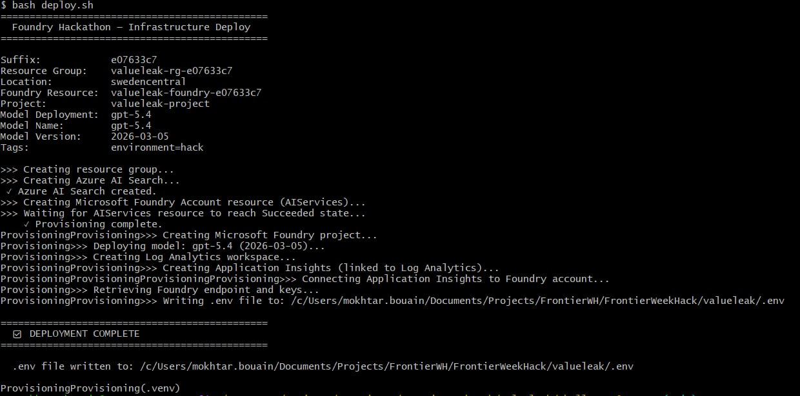

# Challenge 0: Setup & Authentication — ValueLeak AI

Time: ~20 minutes

## Objectives

By the end of this challenge, you will have:

- ✅ A fully provisioned Microsoft Foundry project with a deployed **gpt-5.4** model
- ✅ **Azure AI Search** provisioned for ValueLeak knowledge grounding
- ✅ **Log Analytics** and **Application Insights** provisioned for observability
- ✅ Application Insights connected to the Foundry account
- ✅ A generated `.env` file for the following challenges
- ✅ Verified access to the Foundry project and model deployment



## Get Started

> [!NOTE]
> Before you begin, make sure you have:
> - An **Azure subscription** with permissions to deploy the infrastructure.
> - The **Foundry User** role required to build, evaluate, and run agents in Challenges 1–4.
> - **Azure CLI** installed and authenticated.
> - Python 3.10+ when using a local environment.

The ValueLeak setup keeps the original Factory Challenge 0 approach while extending the infrastructure for RAG and observability.

### Option A: GitHub Codespaces (recommended)

Fork the FrontierWeekHack repository, open it in GitHub Codespaces, then authenticate:

```bash
az login
```

### Option B: Local environment

```bash
git clone https://github.com/microsoft/FrontierWeekHack.git
cd FrontierWeekHack

python3 -m venv .venv
source .venv/bin/activate  # Windows: .venv\Scripts\activate

pip install -r requirements.txt
az login
```

## Deploy Infrastructure

From the ValueLeak Challenge 0 setup folder, run:

```bash
bash deploy.sh
```

The adapted deployment provisions the infrastructure required by ValueLeak AI:

| Resource | Purpose |
|---|---|
| **Azure Resource Group** | Groups the ValueLeak hackathon resources |
| **Microsoft Foundry account** | Agentic AI platform |
| **Microsoft Foundry project** | ValueLeak project workspace |
| **gpt-5.4 deployment** | Model used by the agents |
| **Azure AI Search** | RAG grounding for contracts, FinOps policies and energy guidelines |
| **Log Analytics** | Central telemetry workspace |
| **Application Insights** | Agent tracing and observability |

The default deployment region is **Sweden Central**. Resource names use a generated suffix to avoid collisions.

### Model configuration

```text
Deployment: gpt-5.4
Model:      gpt-5.4
Version:    2026-03-05
SKU:        GlobalStandard
```

## Deployment Execution

A successful ValueLeak deployment produces the following result:


The execution confirms creation of Azure AI Search, the Microsoft Foundry account and project, the gpt-5.4 model deployment, Log Analytics, and Application Insights.

The script then writes the project configuration to the repository-level `.env` file.

## Generated Environment Configuration

The generated `.env` contains the configuration consumed by the following challenges:

```text
AZURE_SUBSCRIPTION_ID
RESOURCE_GROUP

FOUNDRY_RESOURCE_NAME
PROJECT_NAME
FOUNDRY_ENDPOINT
PROJECT_CONNECTION_STRING
MODEL_DEPLOYMENT_NAME

APPLICATIONINSIGHTS_CONNECTION_STRING
APPINSIGHTS_INSTRUMENTATION_KEY

AZURE_EXPERIMENTAL_ENABLE_GENAI_TRACING=true
OTEL_INSTRUMENTATION_GENAI_CAPTURE_MESSAGE_CONTENT=true

AZURE_SEARCH_SERVICE_NAME
AZURE_SEARCH_ENDPOINT
```

> [!IMPORTANT]
> Do not commit the generated `.env` file to source control.

## Verify the creation of your resources

### Azure resources

Open the Azure Portal and verify the ValueLeak resource group and its resources.

Example naming pattern:

```text
valueleak-rg-<suffix>
valueleak-foundry-<suffix>
valueleak-search-<suffix>
valueleak-logs-<suffix>
valueleak-insights-<suffix>
```

> [!NOTE]
> The suffix is unique for each deployment.

### Microsoft Foundry project

Open the Microsoft Foundry portal and verify that you can access:

```text
valueleak-project
```

### Model deployment

Select **Build → Models** (or **Deployments**, depending on the portal version) and verify that **gpt-5.4** is deployed.

Open the model playground, send a test message, and verify that you receive a response.

### Observability

Verify that Application Insights is available as a connected resource. This provides the telemetry foundation used by the tracing and monitoring challenge.

### Azure AI Search

Verify that the Azure AI Search service has been created. It provides the grounding layer later used by the ValueLeak Policy Agent.

## ValueLeak Infrastructure Foundation

```text
                    ┌─────────────────────────┐
                    │   Microsoft Foundry     │
                    │    valueleak-project    │
                    │                         │
                    │       gpt-5.4           │
                    └────────────┬────────────┘
                                 │
             ┌───────────────────┼───────────────────┐
             │                   │                   │
             ▼                   ▼                   ▼
     Azure AI Search     Application Insights   Log Analytics
        RAG / Policy          Tracing             Telemetry
```

This foundation supports the following ValueLeak challenges: persistent agents, policy grounding with RAG, evaluation, tracing, and the reusable multi-domain workflow.

## Success Criteria

- [ ] The ValueLeak resource group has been created
- [ ] The Microsoft Foundry project is accessible
- [ ] The **gpt-5.4** deployment shows a successful state
- [ ] Azure AI Search has been provisioned
- [ ] Log Analytics and Application Insights have been provisioned
- [ ] The `.env` file has been generated
- [ ] You can send a test message to the deployed model
- [ ] The environment is ready for Challenge 1

---

**Next → Challenge 1: Build the ValueLeak Agents**
