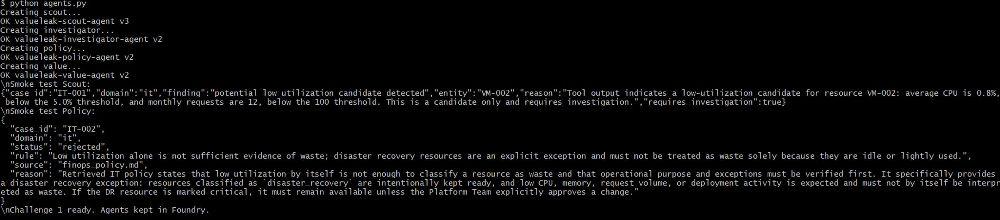
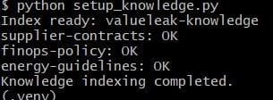

# Challenge 1: Build ValueLeak Agents

Time: \~30--45 minutes

## Objectives

By the end of this challenge, you will have:

-   ✅ A **Scout Agent** that detects potential value-leak candidates
    across Procurement, IT/Cloud, and Energy
-   ✅ An **Investigator Agent** that gathers factual evidence using
    deterministic business tools
-   ✅ A **Policy Agent** that grounds decisions in contracts, policies,
    and guidelines through Azure AI Search
-   ✅ A **Value Agent** that quantifies potential financial or
    environmental impact using deterministic calculations
-   ✅ All four agents created and tested in Microsoft Foundry

## Context

Value leakage is often difficult to detect because the evidence is
distributed across business data, contracts, policies, usage metrics,
and operational records.

ValueLeak AI demonstrates the same reusable multi-agent architecture
across three domains:

1.  **Procurement** --- detect situations where contractual purchasing
    conditions may not have been applied
2.  **IT / Cloud** --- detect low-utilization resources while protecting
    legitimate exceptions such as Disaster Recovery
3.  **Energy** --- detect abnormal energy consumption relative to
    production output while considering documented operating exceptions

The agents are shared across all three domains. Domain-specific
capabilities are implemented as **tools**, not as separate agents.

The ValueLeak flow is:

``` text
Business Data
     |
     v
Scout Agent
     |
     v
Investigator Agent
     |
     v
Policy Agent
     |
     +----> Azure AI Search / valueleak-knowledge
     |
     v
Value Agent
     |
     v
Human Validation
```

> Challenge 1 validates each agent independently. The end-to-end
> orchestration between the four agents is implemented later in the
> workflow challenge.

## Portal or SDK?

Microsoft Foundry provides both a visual portal and an SDK-based
approach for building agents.

For ValueLeak AI, this challenge uses the **Azure AI Agents SDK** so
that agent definitions, tools, prompts, and execution logic can be
versioned and tested as code.

The implementation in [`agents.py`](./agents.py):

-   creates the four ValueLeak agents;
-   registers their Function Tools;
-   handles tool calls returned by the agents;
-   sends tool results back to the model;
-   runs smoke tests from the terminal.

After execution, the agents remain available in the Microsoft Foundry
project and can also be inspected from the portal.

## Agents and Tools

### What is an agent?

In this implementation, each agent has a specific responsibility and a
constrained set of tools.

  -----------------------------------------------------------------------
  Agent                   Responsibility          Main capabilities
  ----------------------- ----------------------- -----------------------
  **Scout**               Detect signals worth    Procurement volume,
                          investigating           cloud utilization,
                                                  energy deviation

  **Investigator**        Gather factual evidence Purchase
                                                  orders/invoices, cloud
                                                  usage/cost,
                                                  production/energy data

  **Policy**              Verify applicable rules Azure AI Search over
                          and exceptions          ValueLeak knowledge

  **Value**               Quantify verified       Deterministic EUR and
                          opportunities           kWh calculations
  -----------------------------------------------------------------------

This separation prevents a single agent from detecting an anomaly,
inventing a rule, and calculating a saving without independent evidence.

### What are tools?

Tools extend an agent beyond language generation. The model receives a
JSON schema describing each available tool and can request a function
call when it needs factual data or a deterministic calculation.

The Python application executes that function and sends the result back
to the agent as a function-call output.

ValueLeak uses domain-specific tools while keeping the agents reusable.

### Scout tools

``` text
scout_procurement
scout_it
scout_energy
```

These tools identify **candidates only**. A candidate is not a confirmed
value leak.

### Investigator tools

``` text
investigate_procurement
investigate_it
investigate_energy
```

These tools retrieve factual evidence from the synthetic ValueLeak
datasets.

### Policy tool

``` text
search_knowledge
```

The Policy Agent queries the `valueleak-knowledge` Azure AI Search
index.

The knowledge base contains:

``` text
supplier_contracts.md
finops_policy.md
energy_guidelines.md
```

This grounding step is important because a technical anomaly can be
legitimate.

For example, a Disaster Recovery resource can have very low utilization
by design. The Policy Agent retrieves the FinOps policy before deciding
whether the candidate should continue to the value-calculation stage.

### Value tools

``` text
value_procurement
value_it
value_energy
```

Important financial and environmental calculations are performed by
deterministic Python functions rather than free-form LLM arithmetic.

No financial, destructive, or operational action is executed
automatically. Final business action requires human validation.

## Knowledge Grounding with Azure AI Search

Before running the agents, the ValueLeak knowledge documents are indexed
in Azure AI Search.

The index used by this challenge is:

``` text
valueleak-knowledge
```

The Policy Agent searches this index by business domain:

``` text
procurement
it
energy
```

This allows the agent to retrieve the relevant contract, FinOps policy,
or energy guideline and use it as evidence for its decision.

## Get Started

Challenge 0 must be deployed first so that the Microsoft Foundry
project, model deployment, Azure AI Search, Application Insights, and
Log Analytics resources are available.

From the repository root, activate the existing virtual environment.

Git Bash on Windows:

``` bash
source .venv/Scripts/activate
```

Then move to Challenge 1:

``` bash
cd valueleak/challenge-1-agents
```

### 1. Index the knowledge base

``` bash
python setup_knowledge.py
```

Expected result:

``` text
Index ready: valueleak-knowledge
supplier-contracts: OK
finops-policy: OK
energy-guidelines: OK
Knowledge indexing completed.
```

### 2. Validate knowledge retrieval

``` bash
python -m pytest test_knowledge.py -v
```

Expected result:

``` text
3 passed
```

The tests validate retrieval for Procurement, IT/Cloud, and Energy.

### 3. Run deterministic tool tests

``` bash
python -m pytest test_procurement_tools.py -v
python -m pytest test_it_tools.py -v
python -m pytest test_energy_tools.py -v
```

These tests validate the deterministic data-access, anomaly-detection,
and value-calculation functions used by the agents.

### 4. Create and test the agents

``` bash
python agents.py
```

The script creates the following agents in Microsoft Foundry:

``` text
valueleak-scout-agent
valueleak-investigator-agent
valueleak-policy-agent
valueleak-value-agent
```

The script intentionally keeps the agents in Foundry for the following
challenges.

#### Agent creation and validation



The execution creates the four persistent ValueLeak agents in Microsoft
Foundry and validates their individual behavior.

The Policy Agent also demonstrates grounded reasoning by retrieving
finops_policy.md and rejecting the Disaster Recovery false positive.


## Expected Results

### Scout Agent

For the IT test case `VM-002`, the Scout identifies a low-utilization
candidate.

Expected evidence includes:

``` text
Average CPU: 0.8%
Monthly requests: 12
requires_investigation: true
```

The Scout does **not** classify the resource as confirmed waste.

### Investigator Agent

For `VM-002`, the Investigator retrieves factual evidence including:

``` text
Resource: VM-TEST-03
Environment: test
Average CPU: 0.8%
Monthly requests: 12
Monthly cost: EUR 500
```

The result is marked ready for policy verification.

### Policy Agent

A low-utilization Disaster Recovery resource is used as an intentional
false-positive case.

The Policy Agent retrieves `finops_policy.md` and identifies the
documented Disaster Recovery exception.

Expected decision:

``` text
status: rejected
source: finops_policy.md
```

This demonstrates that low utilization alone is not sufficient to
classify a resource as waste.

### Value Agent

For the validated `VM-002` opportunity, the Value Agent uses the
deterministic cost calculation.

Expected result:

``` text
Monthly cost: EUR 500
Potential annual value: EUR 6,000/year
Human validation required: true
```

No action is executed automatically.

#### Execution evidence



The three ValueLeak knowledge sources were successfully indexed in
Azure AI Search and are ready for grounded policy retrieval.

## Success Criteria

-   [x] Scout Agent identifies `VM-002` as a low-utilization candidate
-   [x] Investigator Agent retrieves factual usage and cost evidence
-   [x] Policy Agent retrieves grounded rules from Azure AI Search
-   [x] Policy Agent rejects the Disaster Recovery false positive
-   [x] Value Agent calculates EUR 6,000/year of potential annual value
    for `VM-002`
-   [x] Human validation is required before business action
-   [x] All four agents are created in Microsoft Foundry

## Challenge Result

Challenge 1 demonstrates the core ValueLeak reasoning pattern:

``` text
Detect -> Investigate -> Verify -> Quantify -> Human Validate
```

At this stage, each agent and its tools have been validated
independently.

The end-to-end hand-off between agents, production monitoring, and
systematic evaluation are addressed in the following challenges.
