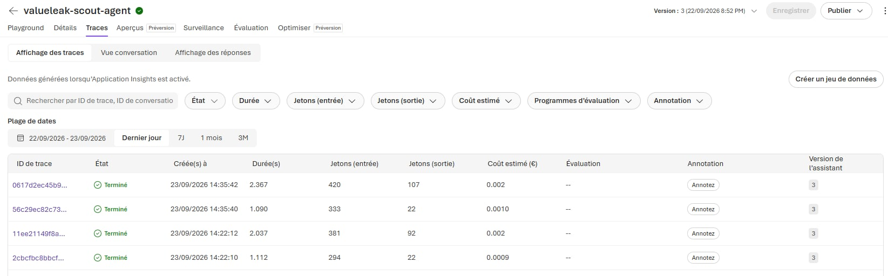
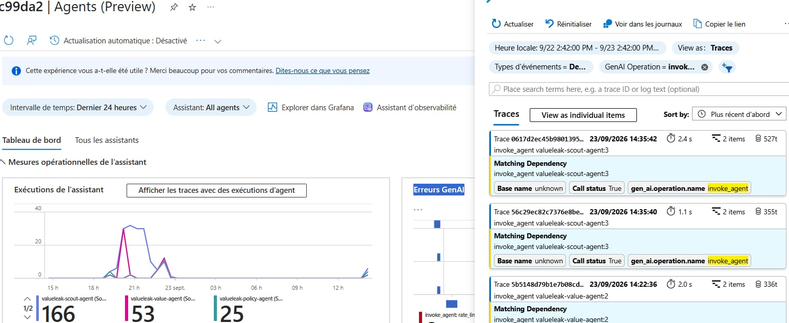

# Challenge 2: Monitor ValueLeak with Application Insights

Time: \~20 minutes

## Objectives

By the end of this challenge, you will have:

-   ✅ GenAI tracing enabled for the ValueLeak Foundry agents
-   ✅ A real `valueleak-scout-agent` interaction visible as a trace
-   ✅ A `scout_it` Function Tool call observable with its input and
    output
-   ✅ Token usage and latency visible in Microsoft Foundry
-   ✅ Application Insights connected through OpenTelemetry for
    production observability
-   ✅ An understanding of how to debug ValueLeak agent behaviour in
    production

## Context

The ValueLeak agents work --- but production readiness requires more
than correct responses.

A ValueLeak candidate passes through AI reasoning, deterministic tools,
business evidence, policy grounding, and value calculation. If an agent
stops calling the correct tool, a tool fails, latency increases, or an
agent misclassifies a candidate, the system must provide enough
telemetry to understand what happened.

For ValueLeak, observability is especially important because a technical
signal is **not automatically a confirmed value leak**.

For example, a low-utilization cloud resource can be a genuine
optimization opportunity, but it can also be an intentional Disaster
Recovery resource. Tracing makes it possible to inspect what the agent
received, which tool it called, what the tool returned, and how the
agent produced its response.

**Application Insights** with **GenAI tracing** provides visibility
into:

-   agent interactions;
-   model calls;
-   tool calls and tool results;
-   token usage;
-   latency and duration;
-   errors and failed operations.

## Why Monitor?

AI agents are probabilistic systems. A successful HTTP response does not
guarantee that the agent selected the correct tool, used the right
evidence, or produced a grounded conclusion.

Monitoring supports three important production capabilities:

-   **Reliability** --- identify failed agent or tool calls and
    unexpected responses
-   **Performance** --- monitor latency, token usage, and operational
    cost drivers
-   **Debugging** --- reconstruct the execution path from input to tool
    call to final response

For ValueLeak, traces also provide evidence that the architecture
respects separation of responsibilities. The Scout detects a candidate,
but it does not independently declare confirmed waste.

## Portal or SDK?

Microsoft Foundry provides a built-in tracing experience for inspecting
agent interactions, while Application Insights provides deeper
operational analysis through Azure Monitor.

This challenge uses the **SDK**.

[`monitor.py`](./monitor.py) configures OpenTelemetry instrumentation
and invokes the existing `valueleak-scout-agent` created in Challenge 1.

Unlike a standalone tracing test agent, the ValueLeak monitoring
scenario uses the real project agent and its real `scout_it` Function
Tool.

The resulting trace can then be inspected in Microsoft Foundry and
Application Insights.

## Prerequisites

Challenge 0 and Challenge 1 must be completed first.

The `.env` file must contain the tracing and Application Insights
configuration created during deployment:

``` text
AZURE_EXPERIMENTAL_ENABLE_GENAI_TRACING=true
OTEL_INSTRUMENTATION_GENAI_CAPTURE_MESSAGE_CONTENT=true
APPLICATIONINSIGHTS_CONNECTION_STRING=InstrumentationKey=...;...
PROJECT_CONNECTION_STRING=...
MODEL_DEPLOYMENT_NAME=gpt-5.4
```

The `valueleak-scout-agent` must already exist in the Microsoft Foundry
project.

## Tracing Architecture

The monitored execution is:

``` text
Monitoring request
       |
       v
valueleak-scout-agent
       |
       v
GPT-5.4
       |
       v
scout_it(VM-002)
       |
       v
Deterministic IT evidence
CPU = 0.8%
Requests = 12/month
Candidate = true
       |
       v
GPT-5.4
       |
       v
Scout response
requires_investigation = true
       |
       v
OpenTelemetry
       |
       v
Application Insights / Foundry Traces
```

The Scout does not classify the resource as confirmed waste. It only
identifies a candidate that requires further investigation.

## Get Started

From the repository root, activate the existing virtual environment.

Git Bash on Windows:

``` bash
source .venv/Scripts/activate
```

Move to Challenge 2:

``` bash
cd valueleak/challenge-2-monitor
```

Run:

``` bash
python monitor.py
```

The script:

1.  loads the tracing environment variables before importing the Foundry
    SDK;
2.  configures `AIProjectInstrumentor`;
3.  configures the Azure Monitor OpenTelemetry exporter;
4.  invokes the existing `valueleak-scout-agent`;
5.  asks the Scout to analyze `VM-002`;
6.  executes the `scout_it` Function Tool when requested by the agent;
7.  returns the deterministic tool result to the agent;
8.  waits for telemetry propagation.

Expected terminal output includes:

``` text
=== Setting up ValueLeak tracing ===
OK AZURE_EXPERIMENTAL_ENABLE_GENAI_TRACING is enabled
OK AIProjectInstrumentor configured
OK Azure Monitor exporter connected

=== Running traced ValueLeak Scout call ===
OK ValueLeak Scout responded

=== Waiting for telemetry propagation ===
OK ValueLeak trace should now be available.

Monitoring test completed.
```

## Step 1: Microsoft Foundry Portal

Open the Microsoft Foundry portal and select the ValueLeak project.

Navigate to:

``` text
Agents
  -> valueleak-scout-agent
  -> Traces
```

Open the most recent monitoring trace.

The trace should show the ValueLeak agent execution trajectory and allow
inspection of:

-   the agent invocation;
-   GPT-5.4 model interaction;
-   tool input/output;
-   execution duration;
-   token usage;
-   final agent response.

### Validated ValueLeak trace

The monitoring test was executed with:

``` text
case_id: MON-IT-001
resource_id: VM-002
```

The `scout_it` tool returned evidence including:

``` text
resource_id: VM-002
candidate: true
avg_cpu_percent: 0.8
monthly_requests: 12
cpu_threshold: 5.0
request_threshold: 100
domain: it
```

The Scout then returned a candidate finding with:

``` text
domain: it
requires_investigation: true
```

The response explicitly treats the resource as a candidate for
investigation rather than confirmed waste.

This validates that the trace contains both the model interaction and
the factual tool result used by the agent.

## Step 2: Application Insights

The same telemetry is exported through OpenTelemetry to the Application
Insights resource configured in `.env`.

In the Azure Portal:

1.  Open **Application Insights**
2.  Select the ValueLeak Application Insights resource
3.  Go to **Investigate**
4.  Open **Search**
5.  Select a recent time range, for example **Last 30 minutes**

Use the trace to investigate agent execution, model operations, latency,
and errors.

The **Agents (preview)** experience can also be used, when available in
the tenant, to inspect operational metrics such as agent runs, tool
calls, model activity, and token consumption.

## What to Look For

When debugging ValueLeak, use traces to answer questions such as:

-   Did the correct agent run?
-   Did the agent call the expected tool?
-   What arguments were passed to the tool?
-   What factual data did the tool return?
-   Did the agent preserve the distinction between a candidate and a
    confirmed leak?
-   How long did the model and overall agent execution take?
-   How many tokens were consumed?
-   Did any model or tool operation fail?

This trace-level visibility becomes especially important when the four
ValueLeak agents are orchestrated into the end-to-end workflow.

## Success Criteria

-   [x] GenAI tracing is enabled
-   [x] `monitor.py` runs successfully
-   [x] Azure Monitor exporter connects to Application Insights
-   [x] A real `valueleak-scout-agent` trace is visible in Microsoft
    Foundry
-   [x] The trace contains the `scout_it` tool interaction and its
    factual output
-   [x] The trace exposes execution duration and token information
-   [x] `VM-002` is identified as a candidate requiring investigation
-   [x] The Scout does not classify the candidate as confirmed waste
-   [x] The execution path can be inspected for debugging and production
    monitoring

## Challenge Result

Challenge 2 demonstrates that ValueLeak agent behaviour is observable
rather than opaque.

For the validated IT scenario, the execution can be followed from the
initial monitoring request through the Scout Agent, GPT-5.4, the
deterministic `scout_it` evidence, and the final candidate response.

This observability foundation will support the later multi-agent
workflow, where traces can be used to understand how a finding moves
through:

``` text
Scout -> Investigator -> Policy -> Value -> Human Validation
```

The next challenge focuses on systematically evaluating the quality and
reliability of the agent behaviour.


### Monitoring & Trace Evidence

The ValueLeak agents are instrumented with Microsoft Foundry observability
and Application Insights to provide end-to-end visibility into agent execution.

The trace captures model execution, agent activity, latency, token usage,
and tool interactions, making it possible to understand how a ValueLeak
decision was produced and to investigate failures or performance issues.

Tracing frome Microsoft Foundry:




Frome application insights azure:




This observability layer provides the foundation for monitoring the
multi-agent workflow as ValueLeak moves from experimentation toward
production.