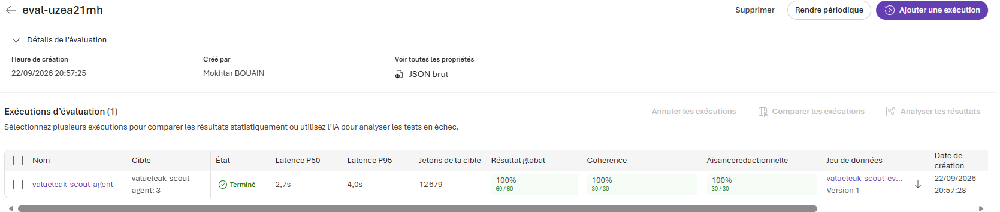

# Challenge 3: Evaluate --- ValueLeak AI

Time: \~30--45 minutes

## Objectives

By the end of this challenge, you will have:

-   ✅ Run a systematic evaluation of the ValueLeak Scout Agent against
    a test dataset
-   ✅ Used Microsoft Foundry built-in evaluators **Coherence** and
    **Fluency**
-   ✅ Interpreted aggregate and per-row evaluation results
-   ✅ Established a repeatable quality baseline for future agent
    versions
-   ✅ Understood how evaluation can support an iterative development
    and CI/CD process

## Context

Monitoring tells you **what's happening** (latency, errors, token
usage). Evaluation tells you **if the answers are actually good**.

ValueLeak AI uses a multi-agent architecture to proactively identify
hidden business value leakage across Procurement, IT / Cloud, and
Energy. This challenge evaluates the **Scout Agent**, the first-stage
agent responsible for detecting signals that may require further
investigation.

This follows the portal-based approach of the original Factory
challenge. The complete Scout → Investigator → Policy → Value workflow
is evaluated after workflow integration.

## Why Evaluate?

Monitoring tells you agents are *running*; evaluation tells you whether
their responses meet expected quality standards.

A repeatable evaluation dataset provides a measurable baseline that can
be rerun after changes to prompts, models, tools, or workflows. For
ValueLeak AI this is important because Scout is the entry point of the
agentic workflow.

## The Evaluation Dataset

Use:

`valueleak/challenge-3-evaluate/eval_portal.jsonl`

The dataset contains **30 scenarios**:

  Domain           Cases
  ------------- --------
  Procurement         10
  IT / Cloud          10
  Energy              10
  **Total**       **30**

Each JSONL row contains:

-   `query` --- the business scenario sent to Scout
-   `ground_truth` --- the expected interpretation or outcome used as
    reference

The dataset contains both potential value-leak cases and normal or
justified situations.

## About the Evaluators

Microsoft Foundry provides built-in evaluators for agent response
quality. This challenge uses:

-   **Coherence** --- whether the response is logically structured,
    internally consistent, and understandable.
-   **Fluency** --- whether the response is clearly and naturally
    written.

## Get Started

### Step 1: Open Evaluations

1.  Open Microsoft Foundry and select the ValueLeak project.
2.  Go to **Build → Evaluations → Create**.

### Step 2: Configure the Evaluation

3.  Select **Agent** as the evaluation target.
4.  Select `valueleak-scout-agent`.
5.  Select **Individual Turns**.
6.  Select **Existing Dataset**.
7.  Choose **Upload new dataset**.
8.  Enter a dataset name, for example `valueleak-scout-eval-v1`.
9.  Upload `eval_portal.jsonl`.
10. Keep the standard field mapping: `query` → `query`, `ground_truth` →
    `ground_truth`.
11. In **Criteria**, keep only **Coherence** and **Fluency**.
12. Deselect **Tool Call Accuracy**, following the Factory challenge
    approach where local tools are not available to the portal
    evaluation execution.
13. Submit the evaluation.

## Evaluation Results

The final Scout evaluation completed across all **30 scenarios**.

  Evaluator          Passed   Failed     Result
  --------------- --------- -------- ----------
  **Coherence**     30 / 30        0   **100%**
  **Fluency**       30 / 30        0   **100%**

These results establish the current Scout Agent as the ValueLeak quality
baseline.

Coherence and Fluency measure **response quality**. They do not by
themselves prove that every numerical or business conclusion is correct.
Domain-specific and end-to-end workflow evaluation can be added as the
solution evolves.

### Microsoft Foundry Evaluation Run

The evaluation was executed directly in Microsoft Foundry:

## Evaluation-Driven Improvement

Evaluation is part of the development cycle rather than a one-time test.

During development, evaluation feedback was used to strengthen the Scout
instructions so it always returns a non-empty final response, including
when evidence is incomplete or a tool cannot be executed.

The updated Scout was then re-evaluated against the complete 30-case
dataset and achieved:

-   **Coherence: 100% (30/30)**
-   **Fluency: 100% (30/30)**

This demonstrates the cycle:

**Evaluate → Identify weakness → Improve → Re-evaluate**

The same approach can later support CI/CD quality gates after changes to
prompts, models, tools, or agent versions.

## Grounding and Future Evaluation

ValueLeak AI already uses **Azure AI Search** to retrieve domain
knowledge for the Policy Agent from supplier contracts, FinOps policies,
and energy guidelines.

Challenge 3 intentionally focuses on Scout. A future extension can
evaluate Policy with grounding-focused criteria. After Challenge 4
integrates the complete workflow, an end-to-end evaluation can cover:

**Scout → Investigator → Policy → Value**

## Success Criteria

-   [x] Evaluation runs against all 30 test cases
-   [x] Per-row Coherence and Fluency results are available
-   [x] Aggregate Coherence and Fluency metrics are available
-   [x] **Coherence: 100% (30/30)**
-   [x] **Fluency: 100% (30/30)**
-   [x] Results establish a repeatable Scout quality baseline
-   [x] Evaluation feedback is used as part of the improvement cycle

## Next Step

Proceed to **Challenge 4** to integrate the ValueLeak multi-agent
workflow:

**Scout → Investigator → Policy → Value**

The workflow will combine proactive detection, evidence collection,
grounded policy verification, deterministic value calculation, and human
validation before action.
