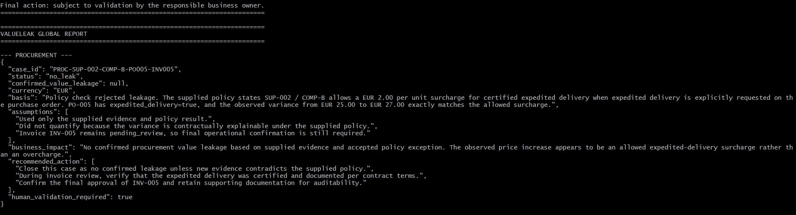
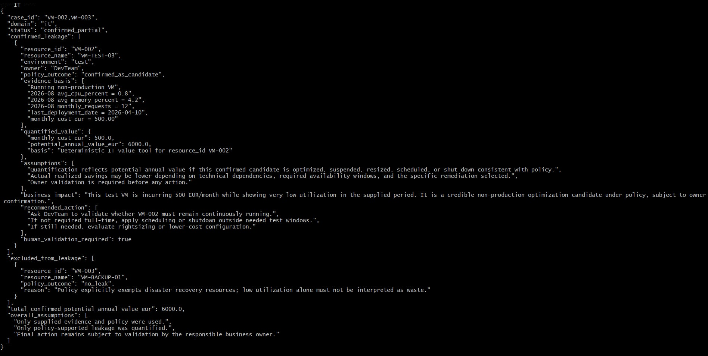
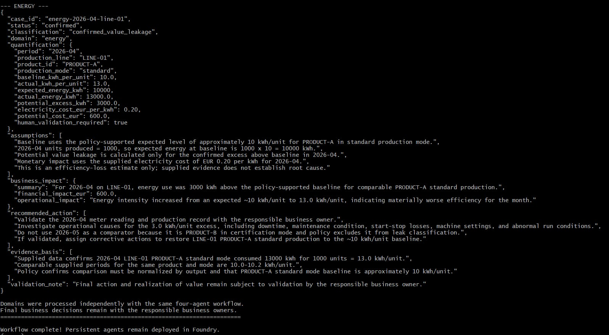

# Challenge 4: Production Workflow — ValueLeak AI

## Objectives

The objective of this challenge is to orchestrate the ValueLeak AI agents into a reusable end-to-end multi-agent workflow and validate the same architecture in Microsoft Foundry.

By the end of this challenge, ValueLeak AI demonstrates:

- orchestration of four persistent specialized agents;
- deterministic business-tool execution;
- Azure AI Search grounding through RAG;
- evidence-based value quantification;
- multi-domain reuse across Procurement, IT / Cloud, and Energy;
- human validation before any business action;
- workflow observability through Microsoft Foundry traces.

---

## Context

ValueLeak AI proactively identifies hidden business value leakage across enterprise data.

The same four agents are reused across all supported domains:

1. **Scout Agent** — detects potential candidates.
2. **Investigator Agent** — gathers and validates evidence.
3. **Policy Agent** — verifies contracts, policies, rules, and exceptions using RAG.
4. **Value Agent** — quantifies policy-supported opportunities using deterministic tools.

The end-to-end workflow is:

```text
Business Data
     |
     v
Scout Agent
     |
     v
Investigator Agent
     |
     v
Policy Agent + RAG
     |
     v
Value Agent
     |
     v
ValueLeak Report
     |
     v
Human Validation
```

The same orchestration is used for Procurement, IT / Cloud, and Energy. Domain-specific capabilities are implemented as tools rather than separate agents.

---

# Part 1 — Build the Workflow with the SDK

The Python implementation orchestrates the persistent ValueLeak agents deployed in Microsoft Foundry.

## Step 1 — Ensure Agents Are Deployed

The workflow first verifies that the following agents already exist in the Foundry project:

```text
valueleak-scout-agent
valueleak-investigator-agent
valueleak-policy-agent
valueleak-value-agent
```

The workflow reuses these persistent agents instead of creating temporary agents for every execution.

The corresponding orchestration function is:

```python
ensure_agents_deployed()
```

## Step 2 — Load Domain Data

Synthetic business data is loaded from the ValueLeak data directory for `procurement`, `it`, and `energy` using:

```python
load_domain_data()
```

All demonstration data is synthetic.

## Step 3 — Run Scout

The Scout Agent identifies potential candidates only through:

```python
run_scout()
```

Depending on the domain, it can invoke `scout_procurement`, `scout_it`, or `scout_energy`. It does not confirm leakage or calculate savings.

## Step 4 — Run Investigator

The Investigator validates the candidate against available business evidence through:

```python
run_investigator()
```

It uses `investigate_procurement`, `investigate_it`, or `investigate_energy`, and identifies supporting evidence, uncertainty, missing information, and readiness for policy validation.

## Step 5 — Run Policy / RAG

The Policy Agent validates the candidate against business rules and exceptions through:

```python
run_policy()
```

It uses the `search_knowledge` tool backed by Azure AI Search. Indexed knowledge includes:

```text
supplier_contracts.md
finops_policy.md
energy_guidelines.md
```

The Policy Agent grounds its decision in retrieved knowledge and cites the relevant source.

## Step 6 — Run Value

The Value Agent receives validated evidence and the policy decision through:

```python
run_value()
```

It quantifies only supported opportunities using deterministic tools: `value_procurement`, `value_it`, and `value_energy`. Every actionable result requires human validation.

## Step 7 — Run the Complete Workflow

The complete orchestration is executed through:

```python
run_valueleak_workflow()
```

```text
Scout → Investigator → Policy / RAG → Value → ValueLeak Report
```

When an agent requests a Python FunctionTool, the SDK orchestration loop receives the function call, executes the corresponding deterministic handler, returns a `FunctionCallOutput`, and continues until the agent produces its final response.

## Run the Workflow

From `valueleak/challenge-4-workflow/`:

```bash
python deploy_challenge4_toolloop_fixed.py --domain procurement
python deploy_challenge4_toolloop_fixed.py --domain it
python deploy_challenge4_toolloop_fixed.py --domain energy
python deploy_challenge4_toolloop_fixed.py --domain all
```

---

## Validated Results

### Procurement

For `SUP-001 / COMP-A`, cumulative quantity reached **6,000 units**. The Policy Agent retrieved `supplier_contracts.md` and confirmed a **10% retroactive discount at 5,000+ units**. The deterministic Value tool calculated:

```text
Gross value:      EUR 72,000
Discount:         10%
Potential value:  EUR 7,200
```

**Result: EUR 7,200 potential Procurement value leakage.**

The workflow also analyzed `SUP-002 / COMP-B`, where an apparent EUR 2/unit invoice variance was explained by the contractual expedited-delivery surcharge because `expedited_delivery = true`.

**Result: no confirmed leakage.** This demonstrates policy-grounded false-positive prevention.

### IT / Cloud

For `VM-002 — VM-TEST-03`:

```text
Average CPU:       0.8%
Monthly requests:  12
Monthly cost:      EUR 500
Environment:       test
```

The Policy Agent retrieved `finops_policy.md` and confirmed that low-utilization non-production resources may be optimization candidates after owner validation. The deterministic Value tool calculated:

```text
EUR 500 × 12 months = EUR 6,000/year
```

**Result: up to EUR 6,000/year potential IT / Cloud optimization value.**

`VM-003 — VM-BACKUP-01` also showed very low utilization, but the Policy Agent identified it as a critical Disaster Recovery resource. The FinOps policy states that low utilization is expected for DR resources.

**Result for VM-003: no leak.**

### Energy / Sustainability

For `LINE-01 / PRODUCT-A / 2026-04`:

```text
Units produced:      1,000
Actual energy:       13,000 kWh
Actual intensity:    13 kWh/unit
Expected baseline:   ~10 kWh/unit
```

The Policy Agent retrieved `energy_guidelines.md`. The deterministic Value tool calculated:

```text
Expected energy:       10,000 kWh
Actual energy:         13,000 kWh
Potential excess:       3,000 kWh
Electricity cost:       EUR 0.20/kWh
Potential excess cost:  EUR 600
```

**Result: 3,000 kWh potential excess consumption and EUR 600 potential excess energy cost.**

The result is an evidence-backed energy-efficiency anomaly, not proof of root cause. Human investigation remains required.

## End-to-End Workflow Results

The same four-agent workflow was executed across the three ValueLeak
business domains.

### Procurement — Policy prevents a false positive



The workflow detected a price difference but, after checking the
applicable policy, correctly classified the case as *NO LEAK* because
the EUR 2/unit difference was an authorized expedited-delivery surcharge.

---

### IT / Cloud — Optimization opportunity confirmed



The workflow identified VM-TEST-03 as a low-utilization test resource:

- CPU: *0.8%*
- Monthly cost: *EUR 500*
- Potential annual value: *EUR 6,000*

A Disaster Recovery resource was also analyzed and correctly excluded
from leakage based on the applicable policy.

*Human validation remains required before action.*

---

### Energy — Efficiency leakage quantified



The workflow identified an energy-efficiency deviation on LINE-01:

- Expected baseline: *~10 kWh/unit*
- Actual consumption: *13 kWh/unit*
- Potential excess: *3,000 kWh*
- Potential financial impact: *EUR 600*

The workflow recommends investigating the operational cause before
corrective action.

---

### What this demonstrates

The three executions use the same agentic pattern:

*Scout → Investigator → Policy → Value → Human Decision*

Only the business data, tools and policy knowledge change between domains.


## Multi-Domain Execution

The workflow was also executed with:

```bash
python deploy_challenge4_toolloop_fixed.py --domain all
```

The same four-agent architecture processed Procurement, IT / Cloud, and Energy sequentially. This validates the ValueLeak design principle: **business domains change, but the agentic workflow remains reusable.**

A domain may contain multiple potential candidates. The current demonstration workflow produces one final case path per domain execution; a future production evolution can fan out multiple Scout candidates into parallel or iterative investigation paths.

---

# Part 2 — Build the Workflow in Microsoft Foundry

The same agent sequence was modeled in the Microsoft Foundry Workflow visual designer.

## Step 1 — Open Workflows

In the ValueLeak Foundry project:

```text
Build → Agents → Workflows
```

A workflow named `valueleak` was created.

## Step 2 — Create the Visual Workflow

```text
Start
  ↓
valueleak-scout-agent
  ↓
valueleak-investigator-agent
  ↓
valueleak-policy-agent
  ↓
valueleak-value-agent
  ↓
End
```

## Step 3 — Connect Agent Outputs

Workflow variables propagate responses between nodes:

```text
Scout
  output → scout_output

Investigator
  input  ← scout_output
  output → investigator_output

Policy
  input  ← investigator_output
  output → policy_output

Value
  input  ← policy_output
  output → value_output
```

The agents use the workflow conversation context.

## Step 4 — Test in Preview

A Procurement scenario was submitted for:

```text
supplier_id = SUP-001
item_id = COMP-A
```

The visual workflow successfully invoked `valueleak-scout-agent`. The Scout identified the expected FunctionTool arguments:

```json
{
  "supplier_id": "SUP-001",
  "item_id": "COMP-A"
}
```

This demonstrates that the workflow can invoke the deployed agent and that the Scout correctly selects the required business-tool inputs.

## Step 5 — Inspect Traces

The Foundry trace showed successful workflow and Scout invocation:

```text
execute_workflow valueleak
└── workflow.build
└── workflow.session
    └── workflow_invoke
        └── valueleak-scout-agent
            └── GPT-5.4
```

The trace provides visibility into workflow execution, agent invocation, model execution, and latency.

---

## SDK vs Visual Workflow Runtime

The ValueLeak business tools are implemented as local Python `FunctionTool` handlers.

During Python SDK execution, the ValueLeak orchestration runtime executes those handlers and sends their results back to the Foundry agents using `FunctionCallOutput`.

The Foundry Workflow Preview successfully invoked the Scout Agent, but the local Python FunctionTool handler was not executed by the visual workflow runtime.

| Capability | Python SDK Workflow | Foundry Visual Workflow |
|---|---|---|
| Four-agent orchestration | Validated | Modeled |
| Persistent Foundry agents | Validated | Validated |
| Agent invocation | Validated | Validated |
| Local Python FunctionTools | Validated | Requires external/hosted runtime |
| Azure AI Search RAG | Validated E2E | Represented through Policy Agent |
| Deterministic calculations | Validated E2E | Requires tool runtime |
| Foundry traces | Available | Validated |

For a production-hosted architecture, deterministic business tools should be exposed through supported hosted or remote tool mechanisms rather than depending on a local Python process.

---

## Human Decision

ValueLeak AI is advisory. It does not automatically stop or resize cloud resources, modify invoices, initiate supplier financial transactions, or modify production equipment.

Actionable findings include:

```text
human_validation_required = true
```

The responsible business owner validates the recommendation before action.

---

## Production Readiness

### Grounding

Policy decisions are grounded through Azure AI Search using indexed business knowledge.

### Deterministic Calculations

Financial and energy impact calculations are performed by deterministic tools rather than free-form LLM arithmetic.

### Separation of Responsibilities

Detection, investigation, policy verification, and value calculation are handled by separate specialized agents.

### Human-in-the-Loop

Business actions require explicit human validation.

### Observability

Microsoft Foundry traces provide visibility into agent and model execution. Application Insights is connected to the ValueLeak environment for observability.

### Evaluation

The Scout Agent was evaluated separately in Challenge 3 using a 30-case dataset covering Procurement, IT / Cloud, and Energy.

```text
Coherence: 100% — 30/30
Fluency:   100% — 30/30
```

---

## Success Criteria

- [x] Persistent ValueLeak agents reused
- [x] Scout → Investigator → Policy → Value orchestration implemented
- [x] FunctionTool execution loop implemented
- [x] Procurement workflow validated
- [x] IT / Cloud workflow validated
- [x] Energy workflow validated
- [x] Multi-domain execution validated
- [x] Azure AI Search RAG validated
- [x] Deterministic value calculations validated
- [x] Policy exceptions and false positives handled
- [x] Human validation enforced
- [x] Foundry visual workflow created
- [x] Workflow variables configured between agents
- [x] Foundry Preview invoked the Scout Agent
- [x] Foundry trace inspected
- [x] Local FunctionTool runtime limitation identified and documented

---

## Result

ValueLeak AI demonstrates a reusable multi-agent workflow that turns scattered enterprise data into evidence-backed opportunities for measurable business value.

Validated demonstration outcomes include:

```text
Procurement:  EUR 7,200 potential value
IT / Cloud:   up to EUR 6,000/year potential value
Energy:       3,000 kWh / EUR 600 potential value
```

The workflow also demonstrated its ability to reject legitimate exceptions, including expedited Procurement charges and critical Disaster Recovery infrastructure.

The same four-agent architecture is reused across all three domains, while domain-specific logic remains encapsulated in deterministic tools and grounded knowledge.

**Turn Hidden Waste into Measurable Value.**
